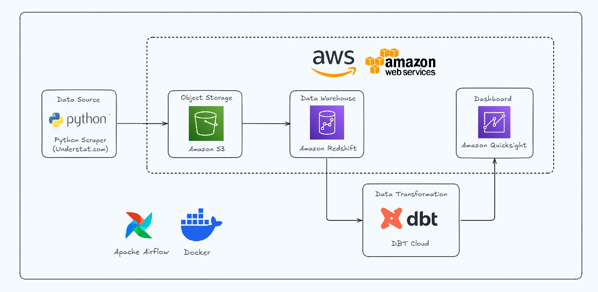
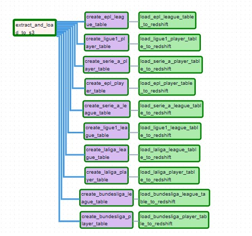
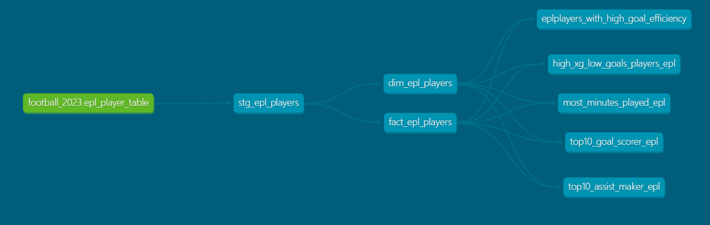
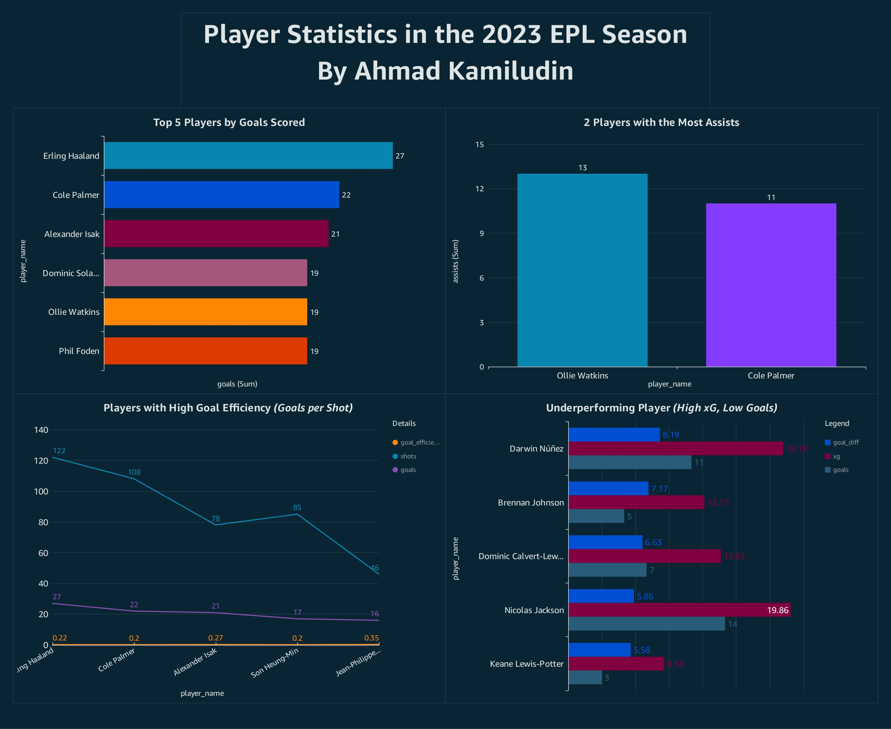

# Data-Driven Football Insights: From Web Scraping to Visualization Using Airflow, Dbt Cloud, and AWS Tech Stack

## Introduction

This project showcases the seamless integration of modern data engineering tools to collect, process, and visualize football statistics from the top five European leagues. It automates data scraping with Apache Airflow, efficiently stores and queries data using Amazon S3 and Redshift, transforms it with dbt Cloud, and creates interactive dashboards in Amazon QuickSight, resulting in a robust pipeline that delivers actionable insights.
## Architecture 

## DAG for Airflow (Extract and Load)

## DAG for Dbt (Only One Source/Table for Demonstration)

## Simple Dashboard

## Technology Used
- Amazon S3
- Amazon Redshift
- DBT (Data Build Tool)
- Amazon Quicksight
- Docker
- Apache Airflow
- Python
- SQL

## Dataset Used
This dataset originates from scraping the understat.com website, which provides detailed statistics on team and player performances from the top five European leagues during the 2023 season, including the English Premier League (EPL), La Liga, Bundesliga, Serie A, and Ligue 1. The data was collected using Python.

More info about dataset:
https://understat.com/

## Article About this Project 
Medium Article - https://medium.com/@ahmadkamiludin/data-driven-football-insights-from-web-scraping-to-visualization-using-airflow-dbt-cloud-and-c04735ac4133